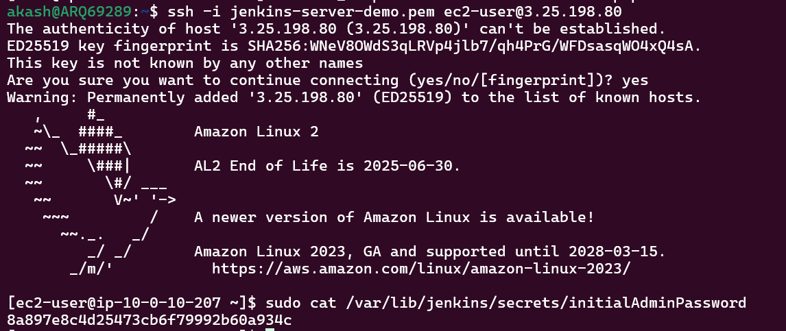
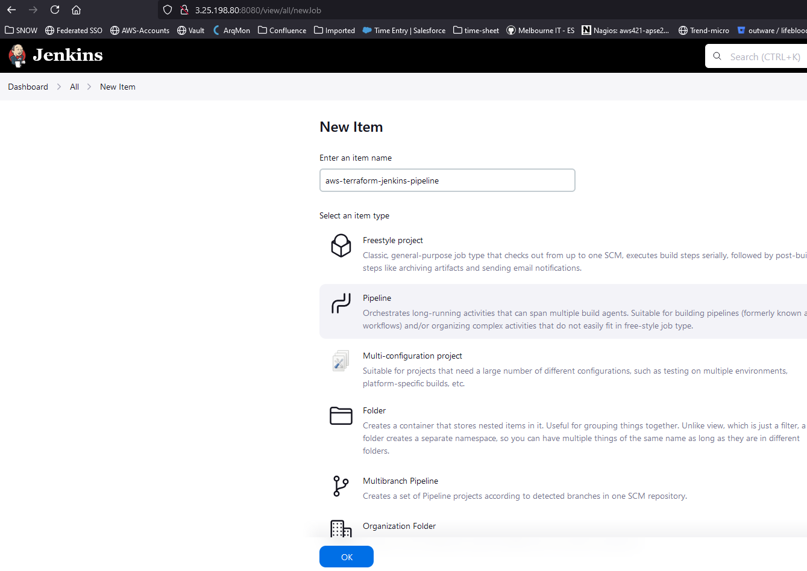
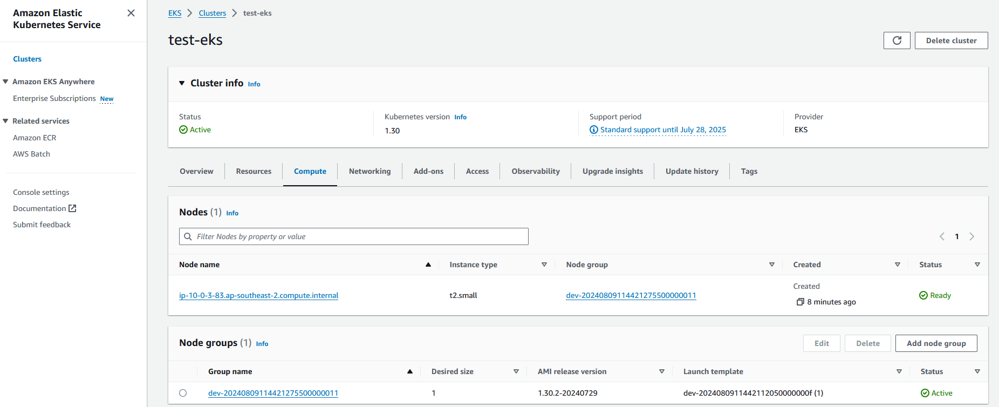
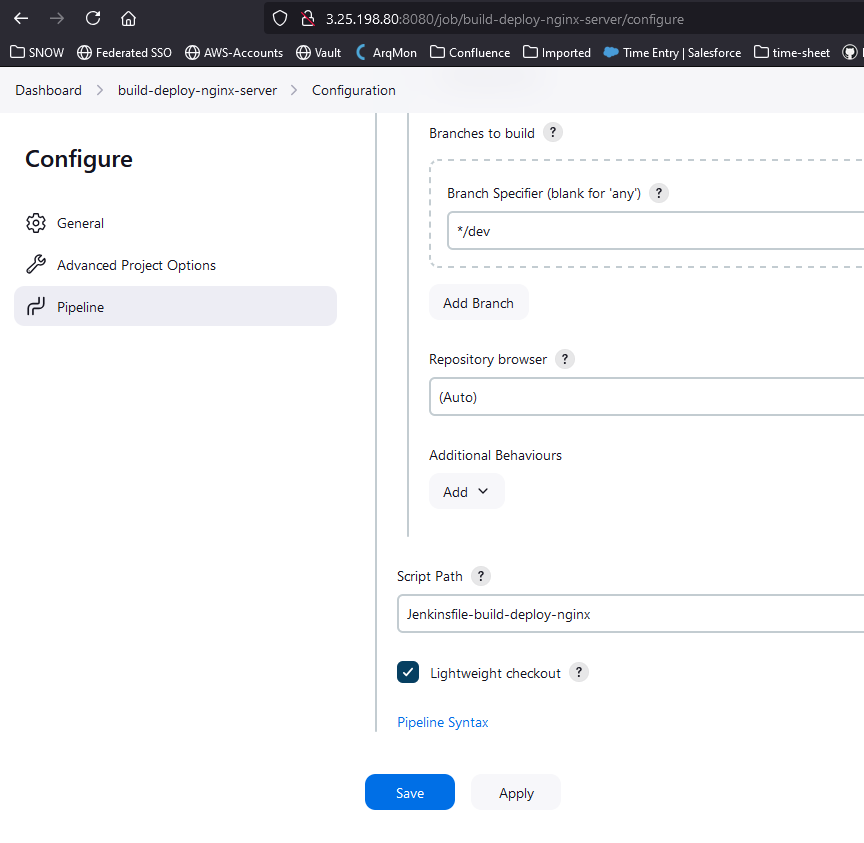

# superloop-technical-assessment
This is an end-to-end project to deploy a Nginx web server through Jenkins and Kubernetes, using Terraform. What we will build will have this structure:


## Project Description
This repository contains the solution for the Superloop technical assessment. The project demonstrates the implementation of Nginx web server through Jenkins and Kubernetes, using Terraform.

To do this, we will follow several steps:

    Create a Jenkins server and install all the dependencies
    Access and setup the Jenkins server with Github and AWS credentials. 
    Create Jenkins pipeline and run the Jenkins pipeline to deploy EKS Cluster.
    Create another Jenkins pipeline to build and deploy Nginx Web Server to the EKS cluster using K8 deployment and service (loadbalancer) 
    Test the application to make sure it’s running
    Clean up and destroy all resources
This project is just one environment deployment, so we will have just a dev environment.

### Project Structure
1. terraform-jenkins-server -> Terraform code to create Jenkins server and install all dependencies using terraform locally.
2. terraform-eks-deployment -> Terraform code to create the EKS cluster and ECR using terraform via jenkins pipeline.
3. kubernetes               -> Contains Dockerfile to create Nginx web server with a custom index.html and yaml files to create deployment and services.
4. Jenkinsfile              -> Groovy script to create EKS cluster
5. Jenkinsfile-build-deploy-nginx -> Groovy script to build and deploy Nginx web server to EKS.
6. Jenkinsfile-destroy      -> Groovy script ti destroy aws terraform resources specifcally the EKS cluster.

## Prerequisites
- AWS Account
- Git installed in your local computer.
- Ec2 Key pair for your Jenkins server - use the same name in the key_name section of the jenkins server -> https://github.com/akashveera/superloop-technical-assessment/blob/master/terraform-jenkins-server/server.tf#L17
- Terraform installed on your local computer. https://k21academy.com/terraform-iac/terraform-installation-overview/
- IAM credentials with enough permissions to create resources in AWS and programmatic access keys.
- AWS credentials that are set up locally with aws configure.

## Installation
1. Clone the repository:
    ```sh
    git clone https://github.com/yourusername/superloop-technical-assessment.git
    ```
2. Navigate to the project directory:
    ```sh
    cd superloop-technical-assessment
    ```
3. Install dependencies:
    ```sh
    [Provide installation commands, e.g., terraform and AWS cli]
    ```

## Running the Project
1. Navigate to the jenkins project directory:
    ```sh
    cd superloop-technical-assessment/terraform-jenkins-server
    ```
2. Run Terraform commands to deploy the Jenkins server in AWS
    ```sh
    terraform init
    terraform validate
    terraform plan
    terraform apply -auto-approve
    ```
    Make a note of the public IP address of your Jenkins server, which will be printed in the console.

3. Access and setup the Jenkins server with Github and AWS credentials.
   1. Paste IP address into your web browser’s address bar, followed by ‘:8080’. The Jenkins server welcome page should show up.
   
   2. To access to our Jenkins server, we need a password. So we first connect to our EC2 instance through SSH, make sure that your terminal is opened in the same   folder as the key you downloaded before (.pem file) when creating the key pair. So, run the following command to connect to the EC2 instance:
   ```sh
    ssh -i "path_to_your_key.pem" ec2-user@your_ec2_instance_ip_address
   ```
   3. Once connected, run the following command to get the Jenkins password:
   ```
   sudo cat /var/lib/jenkins/secrets/initialAdminPassword
   ```
   
   4. Copy the password and paste it into the Jenkins server welcome page to access the Jenkins
   
   5. Install suggested plugins and create a new user to access Jenkins.
   
   
   6. Configure Jenkins to connect to your GitHub repository. Go to Manage Jenkins -> Manage Credentials -> Click on Global -> Add Credentials
   7. In this form you need to select “Username with password” in the kind field and insert your GitHub username and password and give a random ID that can be your username as well.
   
   8. Then we want to allow Jenkins to access our AWS environment, so we need to add the credentials to our AWS account, in particular the AWS Access Key and AWS Secret Key.
   9. Go to Manage Jenkins -> Manage Credentials -> Click on Global -> Add Credentials -> select “Secret text”. It will ask you for a Secret and an ID. In ID specify “AWS_ACCESS_KEY_ID” and in Secret paste your AWS Access Key.
   
   10. Do the same for the AWS Secret Key, but in ID specify "AWS_SECRET_ACCESS_KEY"
   
   11. Now we can configure our Jenkins job to connect to our AWS environment and deploy our EKS cluster.
   12. Go to Jenkins -> New Item -> select “Pipeline” -> call it "aws-terraform-jenkins-pipeline".
   
   13. Click OK and then scroll to the bottom of the page and under Pipeline select “Pipeline script from SCM” and as SCM choose “Git” and then you want to give your GitHub Repository URL and select the credentials we defined before.
   
   14. Select you branch and write the "Jenkinsfile" in script path field, click save.
   
   15. Before clicking Build Now, need to install ansicolor plugin in our jenkins server. Manage Jenkins -> Plugins -> Available plugins -> Search for AnsiColor -> select -> install. 
   
   16. Now we can run our Jenkins job to deploy our EKS cluster. Click on "Build Now" on the jenkins pipeline
   
   Jenkins will take about 10–15 minutes to create the EKS cluster.
   
   17. Once the job is complete, you can verify that the EKS cluster has been created successfully.
   
   


4. Create new Jenkins pipeline to build and deploy Nginx Web Server to the EKS cluster using K8 deployment and service of type loadbalancer.
    1. Go to Jenkins -> New Item -> select “Pipeline” -> call it "build-deploy-nginx-server" -> Click OK
    
    2. Scroll to the bottom of the page and under Pipeline select “Pipeline script from SCM" and as SCM choose “Git” and then you want to give your GitHub Repository URL and select the credentials we defined before.
    
    3. Select you branch and write "Jenkinsfile-build-deploy-nginx" in script path field, click save.
    
    4. Before clicking Build Now, need to install docker plugin in our jenkins server. Manage Jenkins -> Plugins -> Available plugins -> Search for docker -> select Docker and Docker Pipeline -> Click Install
    
    5. Now we can run our Jenkins job to build and deploy Nginx Web Server. Click "Build Now"
   

## Additional Information
- [Any additional notes or information about the project]

## License
This project is licensed under the MIT License - see the [LICENSE](LICENSE) file for details.